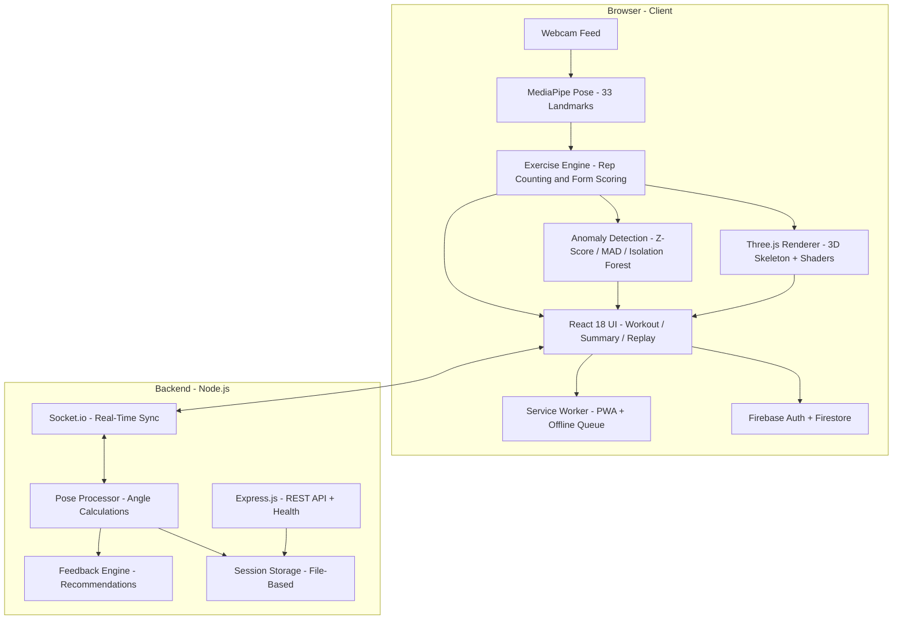

<div align="center">

# 🎯 SpectraX

### AI-Powered Fitness Tracker & Real-Time Pose Visualization

[](https://gssoc.girlscript.org/)
[](https://www.typescriptlang.org/)
[](https://react.dev/)
[](https://threejs.org/)
[](https://socket.io/)
[](https://firebase.google.com/)
[](https://vitejs.dev/)
[](https://opensource.org/licenses/MIT)

An advanced AI-driven fitness companion that tracks workouts, analyzes form in real time, and visualizes your body in 3D — all from a browser webcam. No wearables, no external hardware.

**Proudly participating in [GirlScript Summer of Code 2026](https://gssoc.girlscript.org/)!**

[Features](#-features) · [Demo](#-screenshots) · [Quick Start](#-quick-start) · [Architecture](#-architecture) · [Tech Stack](#%EF%B8%8F-tech-stack) · [Contributing](#-contributing) · [FAQ](FAQ.md)

</div>

---

## 📖 Overview

**SpectraX** is a full-stack fitness application that uses **MediaPipe Pose Detection**, **Three.js**, and **WebSockets** to deliver real-time workout tracking, intelligent form analysis, and immersive 3D body visualization — entirely in the browser.

It doesn't just track your body; it **understands your movement**. SpectraX counts reps, detects which exercise you're performing, scores your form, identifies anomalies with ML algorithms, and renders a live 3D skeleton that mirrors your every move.

### Why SpectraX?

| Traditional Fitness Trackers | SpectraX |
|---|---|
| Requires wearable hardware | Uses only a webcam |
| Basic step/heart-rate counting | Intelligent rep counting with form scoring |
| Manual exercise logging | Auto-detects exercise type via AI |
| 2D dashboards | Real-time 3D body skeleton visualization |
| No posture feedback | Real-time posture correction & anomaly detection |

---

## ✨ Features

### Core Workout Engine

| | Feature | Description |
|---|---|---|
| 🏋️ | **Intelligent Rep Counting** | Automatically counts reps for squats, push-ups, bicep curls, shoulder press, lunges, flutter kicks, and more |
| 📐 | **Real-Time Form Analysis** | Scores each rep based on joint angles and posture accuracy |
| 🔍 | **Auto-Exercise Detection** | AI classifies which exercise you're performing without manual selection |
| 🎥 | **3D Body Mapping** | Real-time skeleton rendered with Three.js and WebGL, with dynamic joint-angle vector shaders |

### Intelligent Feedback

| | Feature | Description |
|---|---|---|
| 🧠 | **Anomaly Detection** | Pure-TypeScript ML engine (Z-Score, Modified Z-Score, Isolation Forest) flags form deviations |
| 💬 | **AI Recommendations** | Post-workout improvement suggestions powered by the feedback engine |
| 🎯 | **Biomechanical Stress Visualization** | Volumetric fog and stress-vector shaders highlight muscle engagement during replay |

### Tracking & Gamification

| | Feature | Description |
|---|---|---|
| 📊 | **Workout Summary** | Post-session analytics with rep streaks, duration, calorie estimates, and accuracy breakdowns |
| 🔄 | **Session Replay** | Review your workout with full 3D replay, complete with camera orbit controls locked to pelvis tracking |
| 🏆 | **Badge & Achievement System** | Earn trophies and track workout streaks |
| 📈 | **Leveling System** | Gain XP and level up as you work out consistently |

### Platform & Infrastructure

| | Feature | Description |
|---|---|---|
| ⚡ | **Real-Time Sync** | Low-latency WebSocket communication with authenticated socket connections, rate limiting, and CORS hardening |
| 🔐 | **Firebase Auth** | Full authentication flow (signup, login, forgot password) with App Check anti-abuse protection |
| 📴 | **Offline Support** | PWA with service worker caching and offline queue for workout data |
| 🖥️ | **FPS Monitoring** | Built-in performance overlay with adaptive throttling for lower-end devices |

---

## 📸 Screenshots

<div align="center">

### Welcome Screen

*Initialize your session, sign in, or browse workout history.*

### Exercise Selection — Bodyweight Squats

*Select from multiple exercises with live camera preview.*

### Exercise Selection — Bicep Curls

*Real-time pose detection ready for bicep curl tracking.*

### Exercise Selection — Plank

*Plank hold detection with live camera feed.*

### Exercise Selection — Push-Ups

*Push-up rep counting with form analysis.*

### Session History

*Review past workout sessions and track your progress over time.*

</div>

---

## 🧠 Architecture



### Data Flow

1. **📷 Capture** — Camera frames are captured in real time via the browser's MediaDevices API
2. **🦴 Pose Estimation** — MediaPipe Pose extracts 33 body landmarks with 3D coordinates
3. **📐 Angle Calculation** — Joint angles are computed using landmark coordinates (with optional GPU-accelerated calculations)
4. **🤖 Exercise Classification** — AI logic auto-detects the current exercise using the activity classification service
5. **🔢 Rep Counting** — State-machine-based algorithms track movement cycles with depth classifiers per exercise
6. **🎯 Form Scoring** — Posture accuracy is evaluated in real time; anomaly detection flags deviations post-session
7. **🎥 3D Rendering** — Three.js renders a live skeleton with volumetric fog and biomechanical stress shaders
8. **⚡ Sync** — Socket.io synchronizes workout data between client and server with auth, rate limiting, and CORS hardening

---

## 🛠️ Tech Stack

| Category | Technologies |
|---|---|
| **Frontend** | React 18, TypeScript, Vite |
| **3D Rendering** | Three.js, WebGL, GLSL Shaders |
| **AI / ML** | MediaPipe Pose, Transformers.js (`@xenova/transformers`) |
| **Backend** | Node.js, Express.js, Socket.io |
| **Auth & Database** | Firebase Auth, Firestore, Firebase App Check |
| **State Management** | React Context API, Custom Hooks |
| **Testing** | Vitest, React Testing Library, Supertest |
| **CI / CD** | GitHub Actions (Node 20.x, 22.x) |
| **PWA** | vite-plugin-pwa, Workbox |
| **Deployment** | Vercel (frontend), configurable backend |
| **Styling** | Vanilla CSS with modular component styles |
| **Icons** | Lucide React |

---

## 📁 Project Structure

```
spectrax_1/
├── public/                          # Static assets
│   ├── assets/demos/                #   Exercise demo videos (squat, pushup, plank, etc.)
│   ├── favicon.svg                  #   App icon
│   ├── icons.svg                    #   UI icon sprites
│   └── model.glb                    #   3D body model for skeleton rendering
│
├── assets/                          # Project assets
│   └── screenshots/                 #   App screenshots for documentation
│
├── src/                             # Frontend source
│   ├── components/                  # React components
│   │   ├── WorkoutScreen.tsx        #   Main workout view with camera + pose
│   │   ├── CalibrationScreen.tsx    #   Pre-workout body alignment
│   │   ├── SummaryScreen.tsx        #   Post-workout analytics
│   │   ├── SummaryScreenSkeleton.tsx#   Skeleton loader for summary
│   │   ├── ReplayScreen.tsx         #   Session replay UI
│   │   ├── Replay3DModel.tsx        #   3D replay with stress shaders
│   │   ├── WelcomeScreen.tsx        #   Landing / exercise selection
│   │   ├── LoginScreen.tsx          #   Login screen
│   │   ├── SignUpScreen.tsx         #   Registration screen
│   │   ├── ForgotPasswordScreen.tsx #   Password recovery
│   │   ├── UserProfileScreen.tsx    #   User profile view
│   │   ├── FitnessCalculator.tsx    #   BMI / calorie calculator
│   │   ├── TrophyRoom.tsx           #   Badge & achievement display
│   │   ├── AIRecommendations.tsx    #   AI workout suggestions
│   │   ├── BadgeNotification.tsx    #   Badge popup notifications
│   │   ├── CursorGlow.tsx           #   Cursor glow effect
│   │   ├── FpsMonitor.tsx           #   FPS performance monitor
│   │   ├── FpsOverlay.tsx           #   FPS overlay display
│   │   ├── ScrollToTopButton.tsx    #   Scroll-to-top button
│   │   ├── WorkoutPanels.tsx        #   Workout info panels
│   │   ├── HistoryPageSkeleton.tsx  #   Skeleton loader for history
│   │   ├── EmptyState.tsx           #   Empty state placeholder
│   │   ├── NotFound.tsx             #   404 page
│   │   ├── ProtectedRoute.tsx       #   Auth route guard
│   │   ├── CameraErrorBoundary.tsx  #   Camera error handling
│   │   └── PageErrorBoundary.tsx    #   Page-level error boundary
│   │
│   ├── services/                    # Core business logic
│   │   ├── exerciseEngine.ts        #   Rep counting & form scoring
│   │   ├── poseService.ts           #   MediaPipe pose processing
│   │   ├── cameraService.ts         #   Camera initialization & management
│   │   ├── sessionRecorder.ts       #   Workout recording & serialization
│   │   ├── gestureService.ts        #   Gesture recognition
│   │   ├── calibrationStateEngine.ts#   Calibration state machine
│   │   ├── calibrationLogic.ts      #   Calibration calculations
│   │   ├── calibrationVisualRenderer.ts #  Calibration overlay rendering
│   │   ├── occlusionPredictor.ts    #   Landmark occlusion handling
│   │   ├── kinematicEngine.ts       #   Motion kinematics
│   │   ├── volumetricFogEngine.ts   #   3D volumetric fog shader engine
│   │   ├── volumetricFogShaders.ts  #   GLSL shader definitions
│   │   ├── workoutSyncService.ts    #   Client-server sync logic
│   │   ├── angleUtils.ts            #   Joint angle calculations
│   │   ├── gpuAngleUtils.ts         #   GPU-accelerated angle utils
│   │   ├── overlayRenderer.ts       #   Canvas overlay rendering
│   │   ├── clipEngine.ts            #   Workout clip engine
│   │   ├── bodyTypeEngine.ts        #   Body type detection
│   │   ├── skeletalSense.ts         #   Skeletal awareness logic
│   │   ├── ghostService.ts          #   Ghost overlay service
│   │   ├── poseLockService.ts       #   Pose lock detection
│   │   ├── syncQueue.ts             #   Data sync queue
│   │   ├── performanceThrottleService.ts #  Adaptive performance throttling
│   │   ├── activityClassificationService.ts # Exercise auto-detection
│   │   ├── wristRotationDetector.ts #   Wrist rotation tracking
│   │   ├── Squat_depth_classifier.ts#   Squat depth classification
│   │   └── Pushup_depth_classifier.ts #  Push-up depth classification
│   │
│   ├── engine/                      # AI engines
│   │   ├── feedbackEngine.ts        #   Post-workout feedback generation
│   │   └── recommendationEngine.ts  #   AI-driven workout recommendations
│   │
│   ├── hooks/                       # Custom React hooks
│   │   ├── useCameraPose.ts         #   Camera + pose detection lifecycle
│   │   ├── useWorkoutSync.ts        #   WebSocket workout sync
│   │   ├── useWorkoutWebSocket.ts   #   WebSocket connection management
│   │   ├── useBadges.ts             #   Achievement tracking
│   │   ├── useLeveling.ts           #   XP & level progression
│   │   ├── useNetworkStatus.ts      #   Online/offline detection
│   │   ├── useAuth.ts               #   Firebase auth hook
│   │   ├── useDisplayConfig.ts      #   Display/resolution config
│   │   ├── useFpsCounter.ts         #   FPS counting hook
│   │   ├── useOffscreenCanvas.ts    #   Offscreen canvas management
│   │   └── usePrefersReducedMotion.ts #  Reduced motion preference
│   │
│   ├── workers/                     # Web Workers (off-main-thread)
│   │   ├── poseWorker.ts            #   Pose processing worker
│   │   └── activityWorker.ts        #   Activity classification worker
│   │
│   ├── context/                     # React Context providers
│   │   ├── AuthContext.tsx           #   Firebase auth state
│   │   ├── SettingsContext.tsx       #   User preferences
│   │   └── ThemeContext.tsx          #   Dark/light theme
│   │
│   ├── config/                      # Configuration
│   │   ├── exercises.ts             #   Exercise definitions & parameters
│   │   ├── firebase.ts              #   Firebase initialization
│   │   ├── badges.ts                #   Badge definitions
│   │   └── poseLandmarks.ts         #   MediaPipe landmark indices
│   │
│   ├── utils/                       # Utility functions
│   │   ├── fitnessCalculations.ts   #   BMI, BMR, calorie math
│   │   ├── calorieEstimator.ts      #   Per-exercise calorie estimation
│   │   ├── streakUtils.ts           #   Workout streak logic
│   │   ├── offlineQueue.ts          #   Offline data queue
│   │   ├── avatarSkins.ts           #   Avatar skin definitions
│   │   ├── badgeIcons.ts            #   Badge icon mappings
│   │   └── debounce.ts              #   Debounce utility
│   │
│   ├── assets/                      # Frontend assets (images, SVGs)
│   ├── styles/                      # CSS modules
│   │   ├── app.css                  #   Global app styles
│   │   ├── auth.css                 #   Authentication page styles
│   │   ├── WelcomeScreen.css        #   Welcome screen styles
│   │   └── FitnessCalculator.css    #   Calculator styles
│   │
│   ├── types/                       # TypeScript type definitions
│   │   └── badge.ts                 #   Badge type interfaces
│   │
│   ├── App.tsx                      # Root app with routing
│   ├── HistoryPage.tsx              # Workout history page
│   ├── SessionCard.tsx              # Session card component
│   ├── useWorkoutHistory.ts         # Workout history hook
│   ├── main.tsx                     # React entry point
│   ├── index.css                    # Global CSS
│   └── style.css                    # Additional global styles
│
├── server/                          # Backend
│   ├── src/
│   │   ├── index.js                 #   Server entry point
│   │   ├── app.js                   #   Express app setup
│   │   ├── app/                     #   App factory (createApp, createServer)
│   │   ├── socket/                  #   Socket.io event handlers
│   │   ├── modules/                 #   Pose processing, sessions, feedback
│   │   ├── middleware/              #   Auth, rate limiting, CORS
│   │   ├── shared/                  #   Shared constants & utilities
│   │   └── config/                  #   Server configuration
│   │
│   ├── sessions/                    #   Session data storage
│   ├── tests/                       #   Backend tests (unit + integration)
│   ├── index.js                     #   Root entry (re-exports src/index.js)
│   ├── .env.example                 #   Backend env template
│   ├── README.md                    #   Backend documentation
│   ├── package.json                 #   Backend dependencies
│   └── vitest.config.js             #   Backend test config
│
├── spectrax_anomaly/                # Anomaly detection module
│   ├── src/                         #   Z-Score, MAD, Isolation Forest algos
│   └── INTEGRATION.md              #   Integration guide
│
├── scripts/                         # Utility scripts
│   ├── setup_labels.sh              #   GitHub label setup script
│   └── verify-theme-security.js     #   Theme security verification
│
├── .github/
│   ├── workflows/ci.yml             # CI pipeline (lint, build, test)
│   ├── ISSUE_TEMPLATE/              # Issue templates (bug, feature, GSSoC task)
│   └── pull_request_template.md     # PR template
│
├── firestore.rules                  # Firestore security rules
├── firestore.indexes.json           # Firestore index definitions
├── firebase.json                    # Firebase project config
├── vercel.json                      # Vercel deployment config
├── vite.config.ts                   # Vite + PWA + SharedArrayBuffer config
├── tsconfig.json                    # TypeScript configuration
├── tsconfig.node.json               # TypeScript config for Node
├── index.html                       # HTML entry point
├── jest.config.cjs                  # Jest configuration
├── .eslintrc.cjs                    # ESLint configuration
└── package.json                     # Dependencies & scripts
```

---

## 🚀 Quick Start

> **Prerequisites**: [Node.js](https://nodejs.org/) v18.x or higher, [npm](https://www.npmjs.com/)

```bash
# 1. Clone the repository
git clone https://github.com/Somil450/spectrax_1.git
cd spectrax_1

# 2. Install frontend dependencies
npm install

# 3. Install backend dependencies
cd server && npm install && cd ..

# 4. Set up environment variables (see below)

# 5. Start the backend (Terminal 1)
cd server && npm run dev

# 6. Start the frontend (Terminal 2)
npm run dev
```

The frontend runs at **`http://localhost:5173`** and the backend at **`http://localhost:3001`**.

---

## 🔐 Environment Variables

### Frontend (`.env` in project root)

Copy `.env.example` and fill in your Firebase credentials:

```env
# Firebase Configuration (from Firebase Console)
VITE_FIREBASE_API_KEY=your_api_key_here
VITE_FIREBASE_AUTH_DOMAIN=your_project.firebaseapp.com
VITE_FIREBASE_PROJECT_ID=your_project_id
VITE_FIREBASE_STORAGE_BUCKET=your_project.appspot.com
VITE_FIREBASE_MESSAGING_SENDER_ID=your_sender_id
VITE_FIREBASE_APP_ID=your_app_id

# Firebase App Check — reCAPTCHA Enterprise site key (optional, leave empty for local dev)
VITE_APPCHECK_RECAPTCHA_KEY=

# Backend URL (client derives WebSocket URL by swapping http → ws)
VITE_BACKEND_URL=http://localhost:3001
```

### Backend (`.env` in `server/` directory)

```env
PORT=3001
ALLOWED_ORIGIN=http://localhost:5173
```

> ⚠️ **Never commit `.env` files to version control.** The `.env.example` file is provided as a template.

### Firebase Setup

1. Create a project at [Firebase Console](https://console.firebase.google.com/)
2. Enable **Authentication** (Email/Password provider)
3. Create a **Firestore** database
4. Copy your project config into the `.env` file
5. Deploy Firestore security rules:

```bash
npm install -g firebase-tools
firebase login
firebase deploy --only firestore:rules
```

> Without deploying these rules, the project runs in Firebase test mode (open access). Always deploy them before going to production.

---

## 💻 Usage

### Workout Flow

1. **Welcome** — Choose an exercise or let SpectraX auto-detect it
2. **Calibration** — Align yourself with the camera for optimal pose tracking
3. **Workout** — Exercise in real time! Watch reps count up, form scores update, and your 3D skeleton mirror your movement
4. **Summary** — Review detailed post-workout analytics: rep streaks, duration, calorie burn, accuracy breakdown, and AI-generated improvement tips
5. **Replay** — Re-watch your session in full 3D with biomechanical stress overlays

---

## 🏃 Supported Exercises

| Exercise | Detection | Rep Counting | Depth Classifier |
|---|:---:|:---:|:---:|
| Bodyweight Squats | ✅ | ✅ | ✅ |
| Push-Ups | ✅ | ✅ | ✅ |
| Bicep Curls | ✅ | ✅ | — |
| Shoulder Press | ✅ | ✅ | — |
| Lunges | ✅ | ✅ | — |
| Flutter Kicks | ✅ | ✅ | — |
| Plank (Hold) | ✅ | ⏱️ Timer | — |

### 🚧 Planned

- Jumping Jacks
- Mountain Climbers
- Burpees

---

## 📊 Performance

| Metric | Value |
|---|---|
| Pose Detection FPS | ~30 FPS |
| Rep Counting Accuracy | ~94% |
| Detection Latency | <100ms |
| Supported Resolution | 720p / 1080p |
| Pose Landmarks | 33 Keypoints (3D) |
| Web Workers | 2 (pose + activity classification) |

> Performance varies by device hardware, lighting conditions, and camera quality. The built-in FPS monitor and adaptive throttle service help maintain smooth performance on lower-end devices.

---

## 📱 Browser Compatibility

| Browser | Support |
|---|---|
| Chrome (Desktop) | ✅ Full Support |
| Edge | ✅ Full Support |
| Firefox | ✅ Full Support |
| Android Chrome | ✅ Full Support |
| Safari / iOS | ⚠️ Experimental |

> **Note**: SpectraX requires `SharedArrayBuffer` support (via `Cross-Origin-Opener-Policy` and `Cross-Origin-Embedder-Policy` headers), which is configured automatically in both the Vite dev server and Vercel deployment.

---

## 🧪 Testing

```bash
# Run frontend tests
npm test

# Run tests in watch mode
npm run test:watch

# Run tests with coverage
npm run test:coverage

# Run lint checks
npm run lint

# Run backend tests
cd server && npm test
```

The project uses **Vitest** with **jsdom** for frontend tests and **React Testing Library** for component testing. The backend uses **Vitest** with **Supertest** for HTTP endpoint testing.

CI runs automatically on push/PR to `main` via GitHub Actions, testing against Node 20.x and 22.x.

---

## 🚢 Deployment

### Frontend (Vercel)

The project includes a [`vercel.json`](vercel.json) with:
- SPA rewrites (all routes → `index.html`)
- Required COOP/COEP headers for `SharedArrayBuffer`
- Service worker cache control

Deploy with:

```bash
npx vercel
```

### Backend

The backend is a standalone Express + Socket.io server. Deploy to any Node.js-compatible platform (Railway, Render, Fly.io, etc.) and set the `ALLOWED_ORIGIN` env var to your frontend URL.

---

## 🗺️ Roadmap

- [ ] AI-based calorie estimation improvements
- [ ] Multi-person pose tracking
- [ ] Voice-guided workout assistant
- [ ] Native mobile application
- [ ] Cloud workout history sync
- [ ] Workout recommendation engine
- [ ] Advanced analytics dashboard with charts
- [ ] Social features (workout sharing, leaderboards)

---

## 🤝 Contributing

SpectraX is a **GSSoC 2026** project and we welcome contributors of all experience levels!

1. **Read** the [Contributing Guide](CONTRIBUTING.md) and [Code of Conduct](CODE_OF_CONDUCT.md)
2. **Find an issue** — Check [open issues](https://github.com/Somil450/spectrax_1/issues) for `good first issue`, `level1`, `level2`, or `level3` labels
3. **Follow the workflow**:
   ```bash
   # Fork & clone
   git clone https://github.com/YOUR_USERNAME/spectrax_1.git
   cd spectrax_1

   # Create a feature branch
   git checkout -b feature/your-feature-name

   # Make changes, test locally, then push
   git push origin feature/your-feature-name
   ```
4. **Open a PR** using the [PR template](.github/pull_request_template.md) and link the issue number

### Commit Convention

| Prefix | Purpose |
|---|---|
| `feat:` | New feature |
| `fix:` | Bug fix |
| `docs:` | Documentation |
| `refactor:` | Code restructuring |
| `test:` | Adding/updating tests |
| `perf:` | Performance improvement |

---

## 🔒 Privacy & Security

- **Local Processing** — Camera data is processed entirely in the browser; no video frames are sent to any server
- **No Raw Video Storage** — SpectraX never stores raw video footage
- **Minimal Data** — Only workout analytics and session summaries are persisted
- **No Third-Party Biometric Sharing** — No personal biometric data is shared externally
- **Firebase App Check** — Optional reCAPTCHA Enterprise integration to protect authentication endpoints from abuse
- **Socket Auth & Rate Limiting** — Backend enforces authentication, rate limits, and CORS policies on WebSocket connections

---

## ❓ FAQ

See the full [FAQ document](FAQ.md) for detailed answers to common questions about setup, exercises, privacy, and troubleshooting.

---

## 📄 License

This project is licensed under the **[MIT License](LICENSE)**.

---

<div align="center">

**SpectraX** — The Future of AI Fitness

Made with ❤️ by [Somil Jain](https://github.com/Somil450) and [amazing contributors](https://github.com/Somil450/spectrax_1/graphs/contributors)

⭐ Star this repo if you find it useful!

</div>